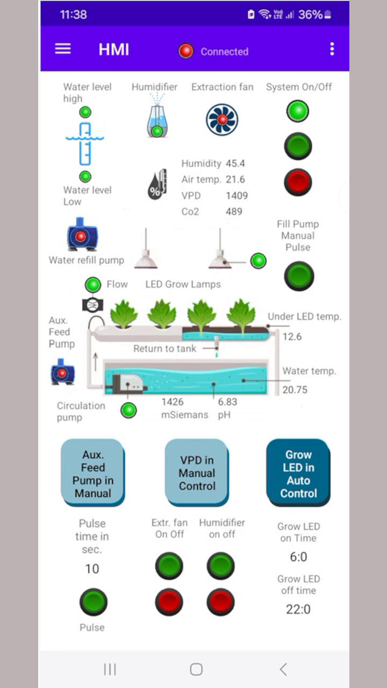
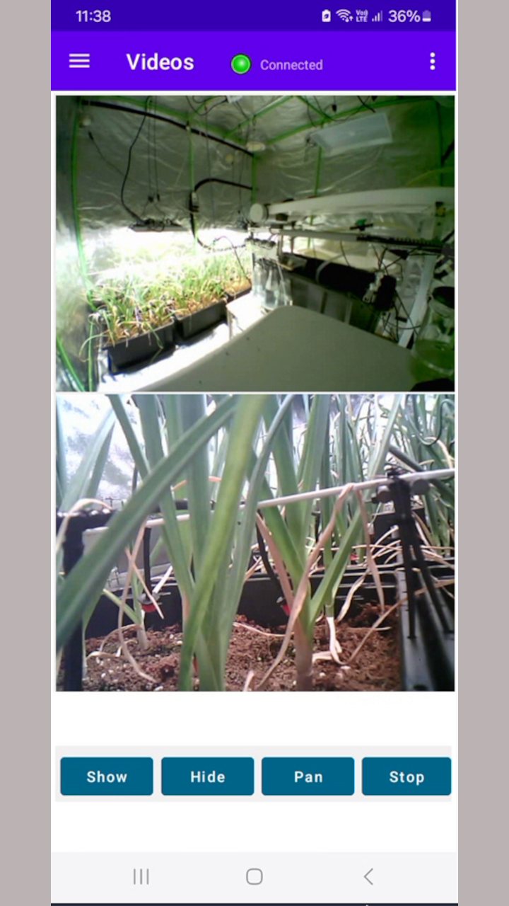
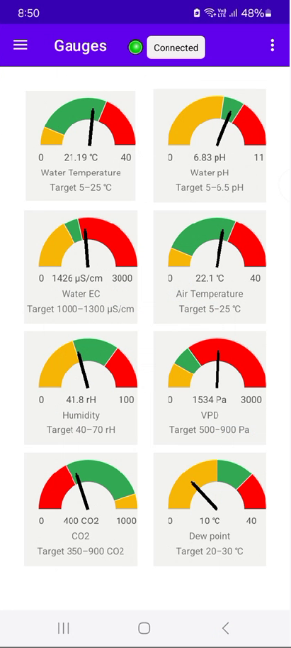
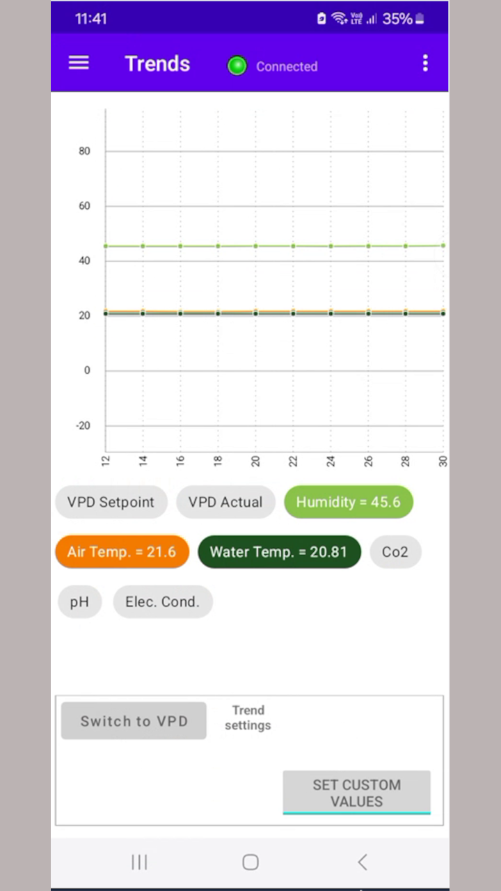
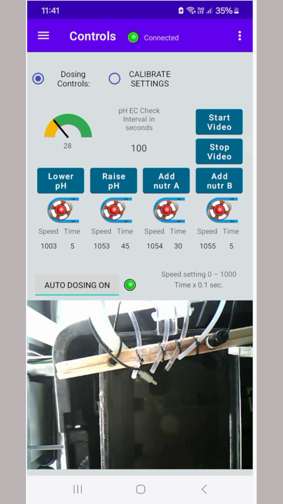

# Automation
## Software and instructions for a Hydroponic Automation Project

This project was inspired by Kyle Gabriel's - Build an Automated Hydroponic System - video and documentation and I would have not discovered the Esp32 if it were not for a world wide shortage of Raspberrys.
I have an inate inability to structure a question to a programming forum that results in either no response or a telling off so ChatGPT has come to the rescue. Never rude. Always manages to understand 
what im getting at, and always moves me forward. The Android app. was coded in Kotlin which I learnt to use with ChatGPT and Android Studio.

This repository contains all the files for a working automated hydroponic system.

The github repository is under construction. When this message is deleted, it will be complete.

Contents:

1. Electrical Diagrams
2. Parts List
3. Program to upload to a 38-pin WROOM ESP32 board
4. Android phone app to view and manage the system
5. Instructions to operate the system
   - a. Instructions for using the app
   - b. Calibration instructions for ESP32 sensor values
   - c. Instructions for configuring the MQTT and Video URLs
6. Program for ESP32-CAM boards - Upload videos to the App

### 1. Electrical Diagrams
   - Page 1 - Power Supplys
   - Page 2 - Esp32 I/O connections
   - Page 3 - Output power Connections    
If an item on the drawing has a PN_ number the Parts list PDF will show a picture of the item I used
in this project with the suppliers name and the Text on there website which should aid a web search.   
There were a few items that were purchased that just didnt work as advertised but this shortlist of items did the job.

### 2. Parts List
As discussed above. The items in this list were reaonably priced and i'm sure that bigger name brand , more expensive items will work just as well.

### 3. Program to upload to a 38-pin WROOM ESP32 board
As a newbie to C, C++, VSCode, Esp32, PlatformIO, Arduino development environment I have committed programming sins but the end result works.
   - Sin no. 1. I have not used header files to split the code so everything is in one long Main CPP. There is however plenty of bookmarkable comments.
   - Sin no. 2. I have used mainly Global variables but with MQTT this seems forgivable.
   - Sin no. 3. I have used simple "if then else" type programming even where loops and cases could drastically improve the code.    

There are changes required to the code before uploading to an Esp32. These are:  
   - Timezone.
   - Cost per killWatt hr. for electricity charges.
   - MQTT connection variables
   - Wifi connection variables  

These will be covered in section 6. of this document. 

### 4. Android phone app to view and manage the system  
This app is still being coded. These are screenshots of the pages under development.
The instructions for using this app are covered in section 6. of this document.       
Main HMI Screen      

      
Videos Screen      

      
Gauges Screen      

      
Trends Screen      

      
Controls Screen      

      

### 5. Instructions to operate the system  

### 6. Program for ESP32-CAM boards - Upload videos to the App  

 b
